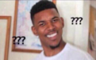

# javascripe中的标签语句
```
    //看代码
    function a() {
        outer: 
        for (let a = 1; a < 10; a++) {
            if (a > 5) {
                break outer;
            }
            console.log(a);
        }
    };
    a();
```
### 代码很简单，但是这个outer是个什么东西，函数中的键值对？？？
<div align=center>
    
</div>
### 搜了一下，这个东西叫标签语句，用处就是标识js中的语句。就像上边的代码中的outer代表了for循环，在条件a>5时，跳出for循环，这样一看也没什么用啊，直接写break就行了，多写个这个还浪费时间。

### 下边该说这个东西有什么用了，，， 

1. 给一个js语句起个名字，名字的格式是：标签名 + 冒号（如 outer：），起完名字就可以像调用函数一样来调用这个语句了,不过一般都是跟break和continue结合使用的。
2. 一般被标记的语句为循环语句，即while、do/while、for和for/in语句，（二般情况还没见过）标记后的循环语句，就可以用break和continue来退出指定的循环或者循环的某一次迭代。

```
//eg:

    outerloop:
    for (var i = 0; i < 3; i++) {
        innerloop: 
        for (var j = 0; j < 3; j++) {
            if (i == 2) {
                break outerloop;
            }
            console.log(j)
        }
    }

```